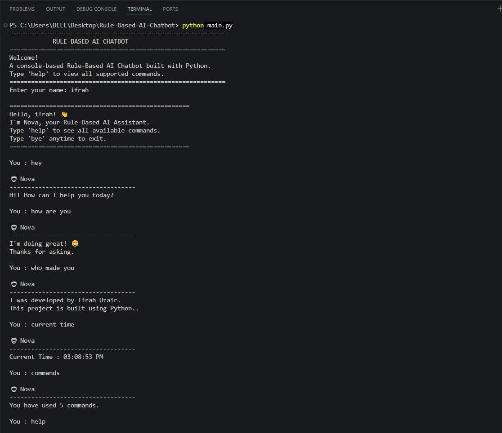

# 🤖 Nova - Rule-Based AI Chatbot

Nova is a console-based Rule-Based AI Chatbot developed in Python. It responds to predefined user inputs using **if-elif-else** decision-making and continues running until the user chooses to exit.

---

## 📌 Project Overview

Nova is a beginner-friendly chatbot that demonstrates the fundamentals of Artificial Intelligence using rule-based logic. It can greet users, answer predefined questions, display the current date and time, tell random programming jokes, count the number of commands entered by the user, and respond gracefully to unknown inputs.

---

## ✨ Features

- 👋 Greets the user
- 💬 Responds to predefined questions
- 🕒 Displays the current time
- 📅 Displays the current date
- 😂 Tells random programming jokes
- 📖 Displays a help menu
- 📊 Counts the total commands used
- 🔄 Runs continuously using a `while` loop
- 🚪 Handles exit commands (`bye`, `exit`, `quit`)
- ❓ Handles unknown inputs gracefully

---

## 🛠️ Technologies Used

- Python 3
- Python Standard Library
  - `random`
  - `datetime`
- Visual Studio Code
- Git
- GitHub

---

## 📂 Project Structure

```text
Nova-Rule-Based-AI-Chatbot/
│
├── main.py
├── chatbot.py
├── responses.py
├── utils.py
├── README.md
├── requirements.txt
├── .gitignore
└── screenshots/
    └── output.png
```

---

## ▶️ How to Run

```bash
python main.py
```

---

## 📚 Python Concepts Used

- Variables
- User Input
- if-elif-else Statements
- while Loop
- Functions
- Lists
- Modules
- Decision Making
- Rule-Based AI

---

## 📸 Project Screenshot

Sample interaction with the chatbot:



---

## 👩‍💻 Author

**Ifrah Uzair**

---

## 📄 License

This project is licensed under the MIT License.